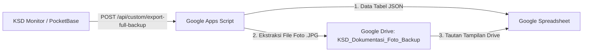

# 📖 Panduan Lengkap Otomasi Backup Database & Foto Dokumentasi KSD Monitor ke Google Spreadsheet (Apps Script)

Dokumen ini menjelaskan tata cara instalasi dan pengoperasian skrip **Google Apps Script** untuk mencadangkan seluruh data tabel database PocketBase dan seluruh file foto dokumentasi lapangan ke **Google Spreadsheet** dan **Google Drive** secara otomatis tanpa biaya langganan.

---

## 🏗️ 1. Arsitektur & Cara Kerja Sistem Backup

1. **Endpoint Khusus Backend**: PocketBase menyediakan endpoint aman `POST /api/custom/export-full-backup` yang merangkum seluruh koleksi aktif (`projects`, `iacs`, `subs`, `dailyProgress`, `validations`, `pts`, `users`, `materialLogs`, `manpowerLogs`, `castable_records`, `notifications`).
2. **Sinkronisasi Tab Otomatis**: Setiap tabel PocketBase otomatis dipetakan ke tab sheet-nya masing-masing dengan header gelap formal (*Executive Navy Theme*).
3. **Ekstraksi Otomatis Foto ke Google Drive**: Setiap foto laporan diubah menjadi file `.jpg` asli dan disimpan di folder Google Drive **`KSD_Dokumentasi_Foto_Backup`**, lalu tautan langsungnya disematkan ke Google Spreadsheet.

---

## 🚀 2. Langkah-Langkah Instalasi (2 Menit)

### Langkah 1: Buat Spreadsheet Baru
1. Buka [Google Sheets](https://sheets.new) di browser Anda.
2. Beri nama file, misalnya: **`Backup Database KSD Monitor`**.

### Langkah 2: Buka Apps Script
1. Di menu atas Google Spreadsheet, klik **Extensions (Ekstensi)** → **Apps Script**.
2. Hapus seluruh baris kode contoh (`function myFunction() { ... }`).

### Langkah 3: Salin Kode Skrip
1. Buka file [`google_apps_script_backup.js`](file:///Volumes/apps/KSD/google_apps_script_backup.js) pada direktori proyek KSD ini.
2. Salin (copy) seluruh kodenya dan tempelkan (paste) ke editor Google Apps Script.

### Langkah 4: Simpan & Jalankan Uji Coba Pertama
1. Klik tombol **Save 💾** (`Ctrl + S` / `Cmd + S`).
2. Di toolbar atas, pastikan terpilih fungsi **`backupKsdToSpreadsheet`**, lalu klik tombol **Run ▶️**.
3. *Otorisasi Izin Akun Google (hanya sekali saat pertama kali jalan)*:
   - Klik **Review Permissions** → Pilih Akun Google Anda.
   - Klik **Advanced** (Lanjutan) → Klik **Go to Untitled project (unsafe)**.
   - Klik **Allow** (Izinkan).
4. Lihat log eksekusi, akan muncul pesan:
   `🎉 SELURUH DATABASE & FOTO DOKUMENTASI KSD BERHASIL DIBACKUP KE GOOGLE DRIVE & SPREADSHEET!`

---

## ⏰ 3. Mengatur Jadwal Otomatis (Tanpa Perlu Buka Website)

Anda dapat mengatur Google Spreadsheet agar menarik data secara otomatis setiap 1 jam atau setiap malam:

1. Pada halaman Google Apps Script, klik menu **Triggers (Ikon Jam Alarm ⏰)** di bilah kiri.
2. Klik tombol biru **+ Add Trigger (+ Tambahkan Pemicu)** di pojok kanan bawah.
3. Atur konfigurasi pemicu:
   * **Choose which function to run**: `backupKsdToSpreadsheet`
   * **Select event source**: `Time-driven`
   * **Select type of time based trigger**: 
     - Pilih `Hour timer` → `Every hour` (Setiap 1 jam), atau
     - Pilih `Day timer` → `23:00 to 00:00` (Setiap malam).
4. Klik **Save**. Selesai!

---

## 📑 4. Daftar Tab yang Dihasilkan di Google Spreadsheet

| Nama Tab Sheet | Deskripsi Isi Data |
| :--- | :--- |
| **`Proyek_KSD`** | Metadata proyek, status pengerjaan, dan area sektor Plant 8 |
| **`Struktur_IAC`** | Daftar Head Jobdesk (IAC), bobot %, dan capaian progres kumulatif |
| **`Sub_Jobdesk`** | Rincian pekerjaan, mitra kontraktor pelaksana, dan status critical path 🚨 |
| **`Laporan_Harian`** | Riwayat input progres harian lengkap dengan **link foto Google Drive** |
| **`Validasi_Progres`** | Antrean & riwayat persetujuan validasi oleh Internal Admin |
| **`Log_Material`** | Pencatatan material direncanakan, terpakai, dan sisa retur |
| **`Log_Manpower`** | Rekap tenaga kerja harian, shift, dan jam kerja efektif |
| **`Daftar_Kontraktor`**| Daftar perusahaan kontraktor (PT TALI, PT HJG, dll.) |
| **`Daftar_Pengguna`** | Akun pengguna sistem dan hak akses role masing-masing |
| **`Inspeksi_Castable`**| Data pengujian batch refractory/castable |
| **`Riwayat_Backup`** | Log audit waktu backup dan status eksekusi |

---

## 🔑 5. Kredensial & Konfigurasi Penting

* **File Skrip**: [`/Volumes/apps/KSD/google_apps_script_backup.js`](file:///Volumes/apps/KSD/google_apps_script_backup.js)
* **KSD Base URL**: `https://policies-back-noble-circuit.trycloudflare.com`
* **Admin Login**: `admin@ksd.com` / `admin123`
* **PocketBase Admin Dashboard**: `https://policies-back-noble-circuit.trycloudflare.com/_/`
