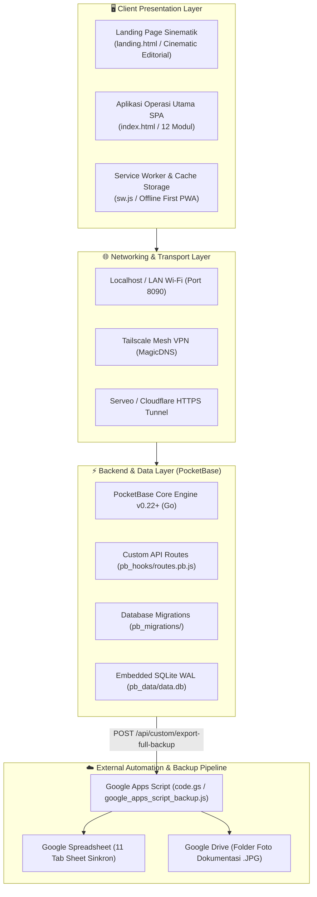

# KSD Monitor — Kiln Shutdown & Overhaul Management System

<div align="center">


-B8860B?style=for-the-badge&logo=go&logoColor=white)


**Platform Manajemen Presisi Tinggi untuk Operasional Shutdown, Overhaul, dan Pemasangan Refraktori Rotary Kiln Industri Semen.**
<br/>
*Designed & Developed by **Haysan Creative***

[Jelajahi Fitur](#-fitur--modul-operasional-lengkap) • [Landing Page Sinematik](#-halaman-landing-sinematik) • [Arsitektur Sistem](#-arsitektur-sistem-terpadu) • [Panduan Akses & Instalasi](#-panduan-instalasi--menjalankan-sistem) • [API & Multi-Tenant](#-keamanan-multi-tenant--hirarki-peran-rbac)

---

</div>

## 📑 Daftar Isi

1. [Ringkasan Eksekutif & Latar Belakang](#-ringkasan-eksekutif--latar-belakang)
2. [Arsitektur Sistem Terpadu](#-arsitektur-sistem-terpadu)
3. [Halaman Landing Sinematik](#-halaman-landing-sinematik)
4. [Fitur & Modul Operasional Lengkap](#-fitur--modul-operasional-lengkap)
   - 01. Dashboard Eksekutif & Telemetri Proyek
   - 02. Engine Kurva-S (S-Curve) Real-time
   - 03. Master Jobdesk IAC & Sub-Jobdesk
   - 04. Entri Progres Lapangan & Anti-Miskeying Guard
   - 05. Validasi Mutu & Dokumentasi Foto 3-Tahap
   - 06. Antrean Persetujuan (Approval Gate Workflow)
   - 07. Kalkulator Presisi Refraktori & Pengujian Castable
   - 08. Logistik Material (Issue, Consumed, Return, Shortage)
   - 09. Manpower & Jam Kerja Efektif Kontraktor
   - 10. Kalender Proyek, Critical Path & Milestone
   - 11. Pusat Laporan Resmi & 1-Klik Ekspor Dokumen
   - 12. Pengaturan Proyek, Baseline & Lessons Learned
5. [Keamanan, Multi-Tenant & Hirarki Peran (RBAC)](#-keamanan-multi-tenant--hirarki-peran-rbac)
6. [Arsitektur Offline-First PWA & Sinkronisasi Lokal](#-arsitektur-offline-first-pwa--sinkronisasi-lokal)
7. [Otomasi Cloud Backup ke Google Spreadsheet & Drive](#-otomasi-cloud-backup-ke-google-spreadsheet--drive)
8. [Struktur Direktori Proyek](#-struktur-direktori-proyek)
9. [Panduan Instalasi & Menjalankan Sistem](#-panduan-instalasi--menjalankan-sistem)
10. [Metode Akses Multi-Device (LAN, Tailscale, Publik HTTPS)](#-metode-akses-multi-device)
11. [Daftar Endpoint Kustom Backend (`pb_hooks`)](#-daftar-endpoint-kustom-backend)
12. [Design System & Panduan Tipografi](#-design-system--panduan-tipografi)
13. [Lisensi & Hak Cipta](#-lisensi--hak-cipta)

---

## 🏭 Ringkasan Eksekutif & Latar Belakang

Operasional pemeliharaan besar (*major overhaul*) dan *shutdown* rotary kiln di industri semen menuntut kecepatan, kepatuhan keselamatan ekstrem, dan akurasi pemasangan bata tahan api (*refractory bricking*) serta *castable* hingga hitungan milimeter. Keterlambatan hitungan jam pada fase *cooling down*, *demolition*, hingga *firing restart* dapat menimbulkan kerugian *downtime* fasilitas senilai ratusan juta rupiah.

Sebelum adanya **KSD Monitor**, tim lapangan menghadapi masalah kritis:
- **Penyebaran Data yang Tercecer**: Laporan progres dan kendala mandor terserak di grup WhatsApp, buku saku fisik, dan kertas catatan yang rentan hilang saat pergantian *shift*.
- **Kerusakan Formula Spreadsheet**: Rumus bobot bobol tertimpa tidak sengaja, kalkulasi Kurva-S meleset, serta entri keliru (>100% atau salah ketik huruf pada kolom kuantitas).
- **Kurangnya Bukti Otentik Mutu**: Tidak adanya arsip foto terstruktur sebelum pembongkaran (*tearing*), saat pemasangan cincin bata, dan saat penguncian hidrolik (*key jack*).
- **Ketergantungan Sinyal Radio di Dalam Silinder Kiln**: Area kerja di dalam cangkang baja (*kiln shell*) merupakan zona tanpa sinyal (blind spot), menyebabkan aplikasi web konvensional gagal menyimpan data.

**KSD Monitor (Kiln Shutdown Dashboard)** hadir sebagai platform operasi tunggal yang menggabungkan keandalan **PocketBase (Go/SQLite)**, arsitektur **Offline-First PWA**, mesin validasi ketat (*Strict Anti-Miskeying Engine*), dan bahasa visual modern berstandar industri.

---

## 🏗️ Arsitektur Sistem Terpadu

Sistem dirancang modular, ringan (*zero heavyweight npm builds* pada antarmuka), dan mampu beroperasi mandiri tanpa dependensi cloud berbayar.



### Komponen Inti:
1. **Frontend Core (`index.html`)**: Aplikasi web tunggal (*Single Page Application*) dengan ~12.000 baris kode terstruktur menggunakan Vanilla JavaScript (ES6+) dan CSS Variables, mengeliminasi risiko *build-pipeline failure* di lapangan.
2. **Showcase Landing Page (`landing.html`)**: Gerbang pendaratan bertaraf editorial yang dirancang dengan standar interaksi dan tata letak modern berkelas tinggi.
3. **Backend Service (`pocketbase`)**: Binary tunggal berbasis Go yang menyematkan SQLite berkinerja tinggi, menyediakan otentikasi JWT/Session, aturan keamanan baris (*Row Level Security*), REST API otomatis, dan Server-Sent Events (SSE).
4. **Hooks & Ekstensi (`pb_hooks/`)**: Kumpulan skrip logika bisnis kustom untuk autentikasi multi-tenant, kalkulasi Kurva-S otomatis, validasi berjenjang, dan backup penuh.
5. **PWA Runtime (`sw.js` & `manifest.webmanifest`)**: Service worker bertipe *Network-First* dengan fallback *Cache-First* dan antrean mutasi lokal saat offline.

---

## 🎨 Halaman Landing Sinematik

Landing page KSD Monitor diakses pada [`landing.html`](file:///Users/haysan/Documents/KSD%20file/landing.html) (tersedia live di `http://localhost:8090/landing.html`), dirancang dengan prinsip estetika tinggi, tata letak berbingkai (*framed shell*), dan interaktivitas panggung kendali modular:

### 1. Karakteristik Desain Panggung Utama
- **Framed Canvas Shell**: Viewport dibungkus frame putih bersih (`padding: 12px; background: var(--paper)`), membingkai panggung seperti karya seni galeri modern.
- **Top Promo Countdown Bar**: Bilah status di atas hero yang menampilkan sequence overhaul (*"D-09 / 14 HARI · 120H 00M 32S MENUJU FIRING"*) dengan counter detik yang berdetak *real-time*.
- **Deep Ocean Hero Card**: Kartu hero berdimensi penuh dengan sudut lengkung halus (`border-radius: 16px; background: linear-gradient(180deg, #0D1B2A, #070D14)`), scrim gradient bawah, dan tipografi editorial rapat (`Inter Tight`, `letter-spacing: -0.04em`).
- **Floating Mode Switcher Dock**: Dermaga vertikal di sisi kanan hero dengan 4 tombol mode (Kurva-S, Foto QC, Kalkulator Tonase, Matriks Dispatch). Mengklik tombol ini secara instan memperbarui telemetri di sudut kanan bawah hero dengan transisi opasitas mulus.
- **Sliding Secondary Frosted Glass Pill Navbar**: Navbar kapsul melayang (`backdrop-filter: blur(28px)`) yang meluncur turun dari atas layar saat pengguna menggulir melewati hero.

### 2. Kursor Interaktif & Efek Grunge Film Grain
- **Dual-Layer Custom Cursor Reticle**:
  - Titik pusat presisi berwarna *flame amber* (`.custom-cursor-dot`) dengan pendaran neon.
  - Cincin bidik HUD luar berkecepatan *lerp* fisik (`.custom-cursor-ring`) yang membesar dan berubah menjadi retikel target saat melayang di atas kartu, tombol, maupun slider.
- **Procedural Film Grain Canvas (`#grungeGrainCanvas`)**:
  - Menghasilkan butiran film 35mm prosedural pada ~16fps tanpa lag GPU/CPU, dipadu dengan *Cinema Spotlight* yang mengikuti kordinat kursor pengguna.
  - Didukung fallback penuh `@media (prefers-reduced-motion: reduce)`.

### 3. Narasi 5 Babak Storytelling (AIDA Architecture)
- **Prolog (Hero Shell & Mode Dock)**: Penegasan proposisi nilai dengan CTA ganda (*"Masuk ke Dashboard Sistem"* & *"Jelajahi Alur Komando"*).
- **Babak I (Realita Lapangan)**: 3 kartu *pain points* (Data tercecer di WhatsApp, Human error salah ketik rumus, Keterlambatan firing tak terdeteksi).
- **Babak II (Panggung Komando Interaktif)**: Kartu panggung gelap dengan tab navigator kiri dan simulasi interaktif kanan:
  - *01 // Input Progres Terproteksi*: Dilengkapi slider interaktif 0–100% dan indikator status anti-miskeying otomatis.
  - *02 // Audit Foto 3 Tahap*: Preview slot foto 3 fase (*Before, During, After*).
  - *03 // Engine Kurva-S Otomatis*: Visual vektor trajektori rencana vs aktual terhitung otomatis.
  - *04 // Kalkulator & Ekspor SPK*: Ringkasan volume m³, tonase, dan tombol ekspor PDF/Excel.
- **Babak III (Sistem Mosaic / Asymmetric Bento Grid)**: Kartu bento variatif berprofil *tall* dan *wide* yang menampilkan kapabilitas PWA offline-first dan kalkulasi delta waktu nyata.
- **Babak IV (Suara Lapangan)**: Testimoni autentik dari Kiln Mechanical Superintendent, Refractory Specialist, dan Project Coordinator.
- **Babak V (Epilog CTA) & Minimalist Footer**: Kartu penutup gelap beradius 20px yang mengarahkan langsung ke sistem operasional.

---

## 🚀 Fitur & Modul Operasional Lengkap

Aplikasi utama KSD Monitor ([`index.html`](file:///Users/haysan/Documents/KSD%20file/index.html)) memuat 12 modul komando:

### 01. Dashboard Eksekutif & Ringkasan KPI (`#view-dashboard`)
- **Status Gate & Target Overhaul**: Ticker hitung mundur hari H (*D-Day countdown*), target durasi hari, dan tanggal penyelesaian terencana.
- **Kartu Metrik Utama**:
  - Akumulasi Progres Riil (%) vs Rencana (%).
  - Varian Deviasi Waktu Nyata (+/- % Deviasi) dengan label status dinamis (*Ahead*, *On-Schedule*, *Critical Delay*).
  - Jam Kerja Aman (*Safe Man-Hours*) dan *Zero Accident Record*.
  - Pemakaian Material Kritis (Bata Magnesite Spinel, Bata High Alumina, Castable).
- **Quick Jump Navigation**: Akses instan 1-klik menuju modul entri progres, audit foto, dan ekspor dokumen.

### 02. Engine Kurva-S (S-Curve) Real-time (`#view-scurve`)
- **Visualisasi Dual-Trajectory**: Kurva S berbasis Chart.js yang memplot trajektori garis dasar (*baseline planned curve*) vs garis realisasi kumulatif harian (*actual cumulative curve*).
- **Analisis Deviasi Otomatis**: Mendeteksi penyimpangan pekerjaan secara matematis pada setiap cut-off date harian.
- **Filter Berdasarkan Disiplin & Area**: Kemampuan menyaring Kurva-S per area kiln (Tyre 1, Tyre 2, Tyre 3, Burning Zone, Inlet, Outlet) atau disiplin (Mekanik, Refraktori, Kelistrikan).

### 03. Master Jobdesk IAC & Sub-Jobdesk (`#view-table`)
- **Struktur Hirarki 2 Tingkat**:
  1. **IAC (Integrated Activity Control)**: Paket pekerjaan induk dengan bobot persentase total 100%.
  2. **Sub-Jobdesk**: Rincian teknis spesifik di bawah IAC yang dieksekusi oleh mitra kontraktor pelaksana.
- **Indikator Jalur Kritis (Critical Path Flag 🚨)**: Penandaan otomatis pada item pekerjaan yang jika terlambat akan langsung menggeser tanggal *start-up firing* kiln.
- **Pencarian & Filter Cepat**: Filter berdasarkan nama kontraktor (PT TALI, PT HJG), zona kiln, status penyelesaian, atau tingkat kekritisan.

### 04. Entri Progres Lapangan & Anti-Miskeying Guard (`#view-input`)
- **Mesin Validasi Ketat (*Strict Typing Engine*)**:
  - Kolom angka secara otomatis memblokir input huruf, simbol khusus, dan karakter ilmiah (`e`, `E`, `+`, `-`).
  - Intersep pada event keyboard `keydown` dan pembersihan instan pada event `paste` clipboard.
  - Membatasi rentang nilai persentase agar tidak bisa diisi di bawah 0% atau melampaui 100%.
  - Kolom nama personil secara ketat memblokir angka `0-9`.
  - Animasi getar (*shake feedback*) dan pesan panduan ergonomis saat pengguna melanggar aturan input.
- **Log Catatan Kendala & Solusi**: Kolom pencatatan penyebab keterlambatan (*Delay Reason Code*), deskripsi hambatan lapangan, dan tindakan pemulihan (*Recovery Action Plan*).

### 05. Validasi Mutu & Dokumentasi Foto 3-Tahap
- **Alur Kerja Dokumentasi Wajib**:
  - **Fase 1 (Before)**: Foto kondisi sebelum pekerjaan dimulai (contoh: kondisi bata aus, *shell crack*, atau material lama).
  - **Fase 2 (During)**: Foto proses pembongkaran jackhammer, pemasangan angkur *V-Anchor*, atau penyusunan cincin bata (*ring installation*).
  - **Fase 3 (After)**: Foto hasil penguncian akhir (*key bricking*), penutupan celah semen tahan api, atau *curing compound*.
- **Kompresi Klien Ringan**: Foto otomatis dioptimalkan sebelum diunggah untuk menghemat bandwidth seluler tanpa mengorbankan ketajaman audit visual.

### 06. Antrean Persetujuan (Approval Gate Workflow) (`#view-validations`)
- **Mekanisme Validasi Berjenjang**:
  - Entri dari mandor lapangan berstatus `Pending Approval`.
  - Supervisor internal / Superintendent mekanik meninjau foto bukti dan persentase yang diajukan.
  - Opsi *Approve* (menyetujui dan memperbarui Kurva-S resmi) atau *Reject* (mengembalikan entri disertai catatan revisi teknis).
- **Audit Trail Lengkap**: Riwayat siapa yang menginput, waktu pengajuan, siapa yang menyetujui, dan catatan justifikasi tersimpan permanen.

### 07. Kalkulator Presisi Refraktori & Pengujian Castable (`#view-castable`)
- **Kalkulasi Geometris Kiln Shell**:
  - Perhitungan volume teoritis ($m^3$) dan berat material ($Ton$) berdasarkan diameter dalam shell ($D$), panjang zona ($L$), ketebalan lining ($T$), dan densitas bata ($kg/m^3$).
- **Perpustakaan Tipe Bata & Densitas**: Data densitas bawaan untuk Magnesite Spinel ($2.95\ g/cm^3$), High Alumina ($2.55\ g/cm^3$), Fireclay ($2.15\ g/cm^3$), dan Calcium Silicate Board ($0.25\ g/cm^3$).
- **Faktor Waste & Estimasi Zak Semen**: Menghitung *wastage margin* (5–10%) dan jumlah zak semen *castable* (kemasan 25 kg atau 50 kg) yang harus disiapkan tim logistik.

### 08. Logistik Material (Material Balance) (`#view-logs`)
- **Pelacakan Siklus Material Lengkap**:
  - `Qty Planned` (Alokasi Rencana SPK).
  - `Qty Issued` (Jumlah yang Dikeluarkan dari Gudang Utama).
  - `Qty Consumed` (Kuantitas yang Terpasang di Shell).
  - `Qty Return` (Sisa Material Utuh yang Dikembalikan ke Gudang).
  - `Shortage` (Kekurangan Material Lapangan yang Membutuhkan Purchase Request Mendesak).

### 09. Manpower & Jam Kerja Efektif Kontraktor (`#view-logs`)
- **Pencatatan Kekuatan Personil**:
  - Pencatatan jumlah teknisi (*fitters*, *bricklayers*, *welders*, *riggers*, *helpers*) per shift kerja (Shift Pagi A dan Shift Malam B).
  - Perhitungan jam kerja manusia (*Man-Hours Actual*) harian untuk memantau produktivitas kontraktor pelaksana.

### 10. Kalender Proyek, Critical Path & Milestone (`#view-calendar`)
- **Matriks Jadwal Harian**: Tampilan kalender interaktif yang memetakan aktivitas kerja sepanjang 14–30 hari durasi overhaul.
- **Penyorotan Milestone**: Titik tonggak krusial seperti *Cooling Down Complete*, *Kiln Alignment Check*, *Tyre Shimming*, *Refractory Inspection Sign-off*, dan *Auxiliary Drive Restart*.

### 11. Pusat Laporan Resmi & 1-Klik Ekspor Dokumen (`#view-reports`)
- **Format Laporan Standar Industri**:
  - **Laporan Harian Overhaul (PDF Resmi)**: Format siap cetak lengkap dengan kop surat perusahaan, tabel progres, deviasi Kurva-S, dan kolom tanda tangan pengawas.
  - **Ekspor Lembar Kerja Excel (.xlsx)**: Seluruh tabulasi raw data siap diolah lanjut untuk evaluasi manajemen.
  - **Berita Acara Serah Terima (BAST)**: Format verifikasi penyelesaian pekerjaan sub-kontraktor.

### 12. Pengaturan Proyek, Baseline & Lessons Learned (`#view-setup` & `#view-guide`)
- **Penguncian Baseline (*Baseline Lock*)**: Mengunci jadwal rencana agar tidak dapat diubah setelah proyek dimulai, menjaga validitas deviasi Kurva-S.
- **Bank Lessons Learned**: Dokumentasi kendala tak terduga dan solusi perbaikan untuk menjadi referensi berharga pada overhaul periode berikutnya.

---

## 🔐 Keamanan, Multi-Tenant & Hirarki Peran (RBAC)

KSD Monitor mengadopsi arsitektur multi-tenant berbasis data, memungkinkan berbagai perusahaan kontraktor (misalnya PT TALI, PT HJG) bekerja di sistem yang sama tanpa dapat saling melihat atau memodifikasi data satu sama lain.

### Tabel Matriks Hak Akses (RBAC)

| Peran (*Role*) | Lingkup Pengguna | Hak Akses Proyek | Entri Progres | Validasi & Approval | Manajemen Akun & PT |
| :--- | :--- | :--- | :--- | :--- | :--- |
| **`internal_admin`** | Tim Inti KSD / Superadmin Pabrik | Penuh (Semua Proyek & PT) | ✅ Baca / Tulis | ✅ Berhak Penuh (Approve / Reject) | ✅ Kelola Akun, PT, & Baseline |
| **`internal_viewer`** | Manajemen / GM / Auditor Internal | Penuh (Semua Proyek) | 👁️ Hanya Baca (*Read-Only*) | 👁️ Hanya Tinjau Riwayat | ❌ Tidak Ada Akses |
| **`kontraktor_admin`**| Project Manager Mitra Kontraktor | Terisolasi (Hanya PT-nya sendiri) | ✅ Buat / Edit Progres PT-nya | ❌ Menunggu Persetujuan Internal | 👁️ Kelola Mandor PT Sendiri |
| **`kontraktor_worker`**| Mandor / Teknisi Lapangan Mitra | Terisolasi (Hanya Sub-Jobdesk PT-nya) | ✅ Entri Progres & Foto Lapangan | ❌ Menunggu Persetujuan | ❌ Tidak Ada Akses |

### Aturan Keamanan Koleksi (*Row Level Security Rules*)
Setiap koleksi di PocketBase dilindungi *API Rules* ketat:
```javascript
// Aturan pembacaan koleksi progres:
@request.auth.role = 'internal_admin' || 
@request.auth.role = 'internal_viewer' || 
(@request.auth.role = 'kontraktor_admin' && contractor = @request.auth.pt_name) ||
(@request.auth.role = 'kontraktor_worker' && contractor = @request.auth.pt_name)
```

---

## 📱 Arsitektur Offline-First PWA & Sinkronisasi Lokal

Area cangkang dalam rotary kiln adalah sangkar Faraday alami yang memblokir sinyal telekomunikasi. KSD Monitor dirancang agar **tetap dapat digunakan 100% saat koneksi internet terputus total**.

```mermaid
sequenceDiagram
    autonumber
    actor Mandor as Mandor di Dalam Kiln Shell
    participant App as KSD Frontend SPA
    participant SW as Service Worker (sw.js)
    participant LocalStore as IndexedDB / LocalStorage
    participant PB as PocketBase Server

    Mandor->>App: Buka form & isi progres harian + lampirkan foto
    App->>SW: Kirim payload entri
    alt Koneksi Internet Terputus (Offline)
        SW-->>App: Network Request Gagal
        App->>LocalStore: Simpan payload ke Antrean Mutasi Lokal (Queue)
        App-->>Mandor: Tampilkan status "Data Tersimpan Offline 📦"
    else Koneksi Internet Aktif (Online)
        SW->>PB: POST /api/custom/save-progress
        PB-->>App: Response Sukses (200 OK)
        App-->>Mandor: Tampilkan status "Tersinkron ke Server ✅"
    end

    Note over Mandor,PB: Mandor keluar dari dalam kiln & terhubung ke Wi-Fi / 4G
    App->>App: Event 'online' terpicu / Tombol 'Offline Sync' ditekan
    App->>LocalStore: Ambil seluruh antrean tertunda
    loop Setiap Antrean
        App->>PB: Kirim data & foto secara berurutan
        PB-->>App: Konfirmasi berhasil disimpan
        App->>LocalStore: Hapus item dari antrean lokal
    end
    App-->>Mandor: Notifikasi "Seluruh Data Offline Berhasil Tersinkronisasi! 🎉"
```



- **Pemasangan di Smartphone (*Add to Home Screen*)**: Aplikasi dapat diinstal langsung di Android dan iOS tanpa melewati Google Play Store atau Apple App Store.
- **Indikator Konektivitas Real-Time**: Status bar di pojok atas secara visual menginformasikan apakah perangkat sedang dalam status *Online* (hijau) atau *Offline* (oranye).

---

## ☁️ Otomasi Cloud Backup ke Google Spreadsheet & Drive

Sistem dilengkapi pipa integrasi mandiri menggunakan **Google Apps Script** ([`code.gs`](file:///Users/haysan/Documents/KSD%20file/code.gs) dan [`google_apps_script_backup.js`](file:///Users/haysan/Documents/KSD%20file/google_apps_script_backup.js)) yang secara periodik mencadangkan seluruh data dan foto ke cloud Google tanpa biaya langganan:

1. **Endpoint Ekspor Lengkap**: PocketBase menyediakan endpoint aman `POST /api/custom/export-full-backup` yang merangkum seluruh tabel database dalam satu payload JSON terenkripsi.
2. **11 Tab Sheet Sinkron Otomatis**:
   - `Proyek_KSD`: Metadata master proyek dan target durasi.
   - `Struktur_IAC`: Daftar paket kerja induk dan bobot %.
   - `Sub_Jobdesk`: Rincian aktivitas teknis dan kontraktor pelaksana.
   - `Laporan_Harian`: Log harian progres dan catatan kendala.
   - `Validasi_Progres`: Log audit approval pengawas internal.
   - `Log_Material`: Kuantitas rencana, terbit, konsumsi, dan sisa retur.
   - `Log_Manpower`: Jam kerja efektif personil kontraktor.
   - `Daftar_Kontraktor`: Data mitra rekanan (PT).
   - `Daftar_Pengguna`: Pengguna terdaftar dan hak akses role.
   - `Inspeksi_Castable`: Data uji sampel refraktori castable.
   - `Riwayat_Backup`: Waktu dan status audit eksekusi backup.
3. **Ekstraksi File Foto Asli ke Google Drive**: Setiap foto yang dilampirkan diekstrak otomatis menjadi file fisik `.jpg` di Google Drive pada folder **`KSD_Dokumentasi_Foto_Backup`**, lalu tautan langsungnya disematkan ke baris Google Spreadsheet terkait.
4. **Jadwal Eksekusi Otomatis**: Dapat diatur berjalan secara mandiri setiap 1 jam atau harian menggunakan fitur *Time-driven Trigger* bawaan Google Apps Script. *(Panduan instalasi lengkap tersedia di [PANDUAN_BACKUP_GOOGLE_SPREADSHEET.md](file:///Users/haysan/Documents/KSD%20file/PANDUAN_BACKUP_GOOGLE_SPREADSHEET.md))*.

---

## 📂 Struktur Direktori Proyek

```text
/Users/haysan/Documents/KSD file/
├── 📄 index.html                       # Aplikasi Operasi Utama SPA (~12.000 baris, 12 modul komando)
├── 📄 landing.html                     # Halaman Landing Sinematik (Cinematic Architecture)
├── 📄 manifest.webmanifest             # Konfigurasi PWA (Icons, Theme Color, Display Standalone)
├── 📄 sw.js                            # Service Worker PWA (Offline Caching & Network-First Strategy)
├── 📄 start_local.sh                   # Script Shell Menjalankan Server Lokal PocketBase (Port 8090)
├── 📄 stop_local.sh                    # Script Shell Mematikan Proses Server Lokal
├── 📄 google_apps_script_backup.js     # Script Google Apps Script untuk Backup ke Spreadsheet & Drive
├── 📄 code.gs                          # Skrip Google Apps Script Alternatif Terintegrasi
├── 📄 PANDUAN_BACKUP_GOOGLE_SPREADSHEET.md # Panduan Detail Konfigurasi Ekstensi Google Apps Script
├── 📄 README.md                        # Dokumentasi Komprehensif Sistem (Dokumen Ini)
├── 📄 CHANGELOG.md                     # Riwayat Pembaruan dan Patch Catatan Rilis Engine
├── 📄 LICENSE.md                       # Lisensi Hak Penggunaan Sistem
├── 📄 ksd-landing-page.pen             # Berkas Desain Visual Kanvas Pen.dev
│
├── 📁 pb_data/                         # Database Penyimpanan Fisik PocketBase
│   ├── 📄 data.db                      # Basis Data Utama SQLite (WAL Mode)
│   └── 📄 auxiliary.db                 # Basis Data Log & Internal PocketBase
│
├── 📁 pb_hooks/                        # Logika Bisnis Kustom Backend (Goja JavaScript Engine)
│   ├── 📄 routes.pb.js                 # >40 Endpoint REST API Kustom (Multi-Tenant, Kurva-S, Validasi)
│   ├── 📄 seed.pb.js                   # Generator Data Awal (Dummy Proyek, Pengguna, & Jobdesk)
│   └── 📄 utils.js                     # Utilitas Backend (Parser Body, Token Generator, Response Helper)
│
├── 📁 pb_migrations/                   # Skema Basis Data & Migrasi Terkontrol
│   ├── 📄 1723120000_init_ksd.js       # Migrasi Inisialisasi Koleksi KSD (Proyek, IAC, Daily Progress, dll)
│   └── 📄 1723200000_multi_tenant.js   # Migrasi Dukungan Multi-Tenant (PT, Jobdesk Scope, Role)
│
├── 📁 pb_public/                       # Direktori File Statis yang Disajikan Otomatis oleh PocketBase
│   ├── 📄 index.html                   # Mirroring Aplikasi Operasi Utama
│   ├── 📄 landing.html                 # Mirroring Landing Page Sinematik
│   ├── 📄 sw.js                        # Mirroring Service Worker
│   └── 📄 manifest.webmanifest         # Mirroring Manifest PWA
│
├── ⚙️ pocketbase                       # Binary Eksekusi Server PocketBase (macOS / Linux ARM/x64)
└── 📁 .agents/skills/                  # Standar Desain, UI/UX, Aksesibilitas, dan Engineering Antigravity
```

---

## 💻 Panduan Instalasi & Menjalankan Sistem

### Prasyarat Sistem:
- Sistem Operasi: macOS, Linux, atau Windows (via WSL2).
- Ruang Disk: Minimum 100 MB.
- Dependensi: **Zero External Dependencies** (PocketBase adalah *self-contained executable binary*).

### 1. Menjalankan Server Menggunakan Script Cepat
Di terminal, jalankan perintah berikut dari direktori proyek:
```bash
# Berikan izin eksekusi skrip (hanya sekali):
chmod +x start_local.sh stop_local.sh pocketbase

# Jalankan server KSD Monitor:
./start_local.sh
```
*Output yang dihasilkan:*
```text
🚀 Menjalankan KSD Monitor PocketBase server pada port 8090...
✅ KSD Monitor berhasil dijalankan! (PID: 12345)
--------------------------------------------------------
🌐 Web App URL        : http://127.0.0.1:8090
📊 Admin Dashboard    : http://127.0.0.1:8090/_/
📜 File Log           : pocketbase.log
--------------------------------------------------------
```

### 2. Mematikan Server
```bash
./stop_local.sh
```

### 3. Menjalankan Server Secara Manual via CLI
```bash
./pocketbase serve --http="0.0.0.0:8090"
```
*(Menggunakan `0.0.0.0` memungkinkan server dapat diakses oleh perangkat lain dalam satu jaringan Wi-Fi/LAN).*

---

## 🌐 Metode Akses Multi-Device

KSD Monitor mendukung berbagai metode deployment fleksibel sesuai kondisi lapangan:

```text
┌─────────────────────────────────────────────────────────────────────────┐
│                        METODE AKSES KSD MONITOR                         │
├──────────────────┬─────────────────────────────┬────────────────────────┤
│ METODE           │ ALAMAT URL                  │ KETERANGAN             │
├──────────────────┼─────────────────────────────┼────────────────────────┤
│ Host Lokal       │ http://localhost:8090/      │ Komputer Server        │
│ Landing Page     │ http://localhost:8090/landing.html │ Master Island Navbar │
│ Wi-Fi Intranet   │ http://192.168.1.5:8090/    │ HP/Tablet di Ruang CCR │
│ Tailscale Mesh   │ http://100.99.188.113:8090/ │ VPN Privat Antar-Kota  │
│ MagicDNS         │ http://ksd-monitor.tail76fff5.ts.net/ │ Domain VPN   │
│ Cloudflare HTTPS │ https://firewall-designated-preview-crowd.trycloudflare.com/ │ Akses Publik Global │
└──────────────────┴─────────────────────────────┴────────────────────────┘
```

### 1. Akses Lokal (Browser Komputer Host)
- **Aplikasi Utama**: `http://localhost:8090/` atau `http://127.0.0.1:8090/`
- **Landing Page**: `http://localhost:8090/landing.html`
- **Admin PocketBase Dashboard**: `http://localhost:8090/_/`

### 2. Akses Tanpa Instal Aplikasi via Wi-Fi Lokal (HP / Tablet)
Hubungkan smartphone mandor ke jaringan Wi-Fi yang sama dengan komputer host, lalu buka alamat IP lokal komputer host:
```text
http://192.168.1.5:8090/
```

### 3. Akses Privat Terenkripsi via VPN Tailscale
Bagi manajemen kantor pusat atau pengawas luar pabrik yang terhubung ke jaringan Tailscale akun tim:
- **Alamat IP Tailscale**: `http://100.99.188.113:8090/`
- **Tailscale MagicDNS**: `http://ksd-monitor.tail76fff5.ts.net/`

### 4. Akses Publik Global Online via Cloudflare Tunnel (HTTPS)
Dapat diakses langsung dari perangkat manapun di seluruh dunia (HP Android, iPhone, Laptop) via koneksi internet publik berkecepatan tinggi dengan sertifikat SSL/TLS aman:
- **Landing Page Sinematik**: [https://firewall-designated-preview-crowd.trycloudflare.com/landing.html](https://firewall-designated-preview-crowd.trycloudflare.com/landing.html)
- **Dashboard Operasi KSD**: [https://firewall-designated-preview-crowd.trycloudflare.com/](https://firewall-designated-preview-crowd.trycloudflare.com/)


---

## 🔌 Daftar Endpoint Kustom Backend (`pb_hooks/routes.pb.js`)

PocketBase diperkaya dengan kumpulan endpoint kustom untuk menangani logika bisnis khusus:

| Method | Endpoint Path | Keterangan & Fungsionalitas |
| :--- | :--- | :--- |
| `POST` | `/api/custom/login` | Otentikasi sesi multi-tenant, fallback alias, dan pembuatan session token 4 jam |
| `POST` | `/api/custom/logout` | Revokasi sesi pengguna aktif |
| `POST` | `/api/custom/project-data` | Memuat data lengkap proyek aktif (IAC, Sub, Daily Progress, Validations, Config) |
| `POST` | `/api/custom/projects-summary`| Rekapitulasi status seluruh proyek overhaul aktif untuk dashboard eksekutif |
| `POST` | `/api/custom/save-progress` | Menyimpan entri progres harian baru disertai lampiran foto dan komputasi Kurva-S |
| `POST` | `/api/custom/validate-progress`| Pengajuan validasi baru dari tim pelaksana lapangan |
| `POST` | `/api/custom/approve-validation`| Otorisasi persetujuan / penolakan laporan progres oleh pengawas internal |
| `POST` | `/api/custom/get-pending-validations`| Mengambil antrean laporan lapangan yang belum diverifikasi |
| `POST` | `/api/custom/notifications` | Mengambil feed notifikasi real-time sesuai otorisasi peran pengguna |
| `POST` | `/api/custom/mark-notifications-read`| Menandai notifikasi telah dibaca |
| `POST` | `/api/custom/get-pts-list` | Mengambil daftar master perusahaan kontraktor rekanan (PT) |
| `POST` | `/api/custom/get-users-list` | Mengambil daftar pengguna aktif di bawah kewenangan admin |
| `POST` | `/api/custom/create-user` | Pendaftaran akun personil lapangan baru dengan pembatasan jobdesk scope |
| `POST` | `/api/custom/save-baseline` | Mengunci data baseline rencana (*baseline schedule lock*) |
| `POST` | `/api/custom/save-material-log`| Pencatatan logistik material masuk, terpakai, dan sisa retur |
| `POST` | `/api/custom/save-manpower-log`| Pencatatan personil kontraktor dan jam kerja efektif harian |
| `POST` | `/api/custom/submit-lessons-learned`| Dokumentasi arsip pembelajaran teknis pasca-overhaul |
| `POST` | `/api/custom/get-castable-data`| Mengambil master kategori, tipe densitas, dan riwayat uji castable |
| `POST` | `/api/custom/submit-castable` | Menyimpan hasil kalkulasi volume, tonase, dan inspeksi refractory castable |
| `POST` | `/api/custom/export-full-backup`| Endpoint komprehensif pengekspor seluruh basis data untuk pipeline Google Sheets |

---

## 🎨 Design System & Panduan Tipografi

Antarmuka KSD Monitor dirancang dengan filosofi **Industrial Precision**: fungsional, kontras tinggi, minim gangguan dekoratif yang tidak perlu, dan nyaman di mata teknisi lapangan.

### 1. Palet Warna Desain (Tokens)

```css
:root {
    /* Nuansa Gelap Industri & Latar */
    --black: #0A0A0A;
    --carbon: #121620;
    --graphite: #2A3342;
    --ocean-hero: #0D1B2A;
    --ocean-deep: #070D14;
    
    /* Nuansa Terang & Netral */
    --paper: #FFFFFF;
    --fog: #F8FAFC;
    --mist: #E2E8F0;
    --ash: #94A3B8;
    --zinc: #64748B;

    /* Aksen Sinyal & Operasional */
    --accent-blue: #2563EB;       /* Brand Primer & Trajektori Aktual Kurva-S */
    --flame-amber: #F59E0B;       /* Suhu Kiln, Peringatan, & Kursor Bidik */
    --signal-green: #10B981;      /* Status Ahead of Schedule & Selesai */
    --signal-red: #EF4444;        /* Critical Delay & Jalur Kritis 🚨 */
}
```

### 2. Standar Tipografi
- **Display Headlines**: `Inter Tight` / `Plus Jakarta Sans` dengan `letter-spacing: -0.03em` s/d `-0.04em` untuk judul besar yang berwibawa dan mudah dipindai cepat.
- **Antarmuka Pengguna (UI Body)**: `Plus Jakarta Sans` untuk kenyamanan membaca data teknis berdensitas tinggi.
- **Data Telemetri & Angka**: `JetBrains Mono` / `IBM Plex Mono` untuk angka persentase, koordinat stasiun, meter lari, tonase, dan kode error agar tabular dan presisi secara visual.

---

## 📄 Lisensi & Hak Cipta

Sistem ini dirancang dan dikembangkan secara independen oleh **Haysan Creative** untuk kebutuhan operasional manajemen dan pemantauan pemeliharaan rotary kiln industri presisi tinggi.

**Hak Cipta © 2026 Haysan Creative. All Rights Reserved.**  
Seluruh hak cipta dilindungi undang-undang. Karya dan produk sistem ini dikembangkan oleh **Haysan Creative**. Rincian ketentuan lisensi perangkat lunak tercantum pada berkas [`LICENSE.md`](file:///Users/haysan/Documents/KSD%20file/LICENSE.md).